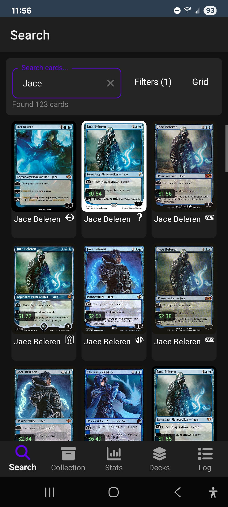
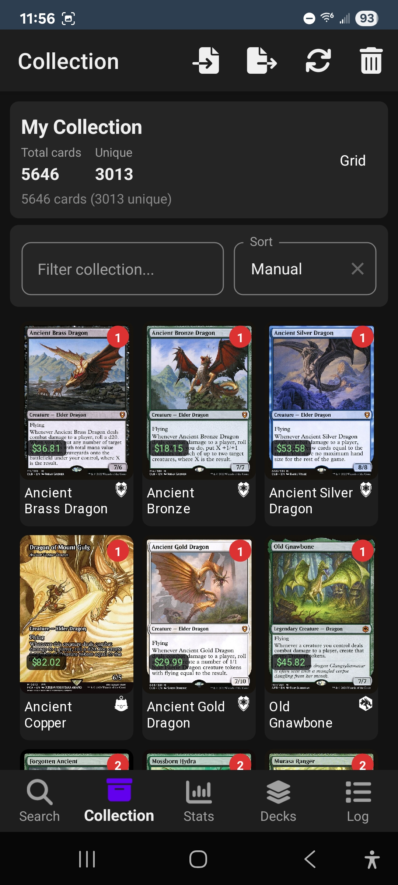
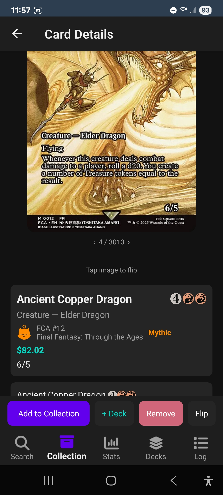
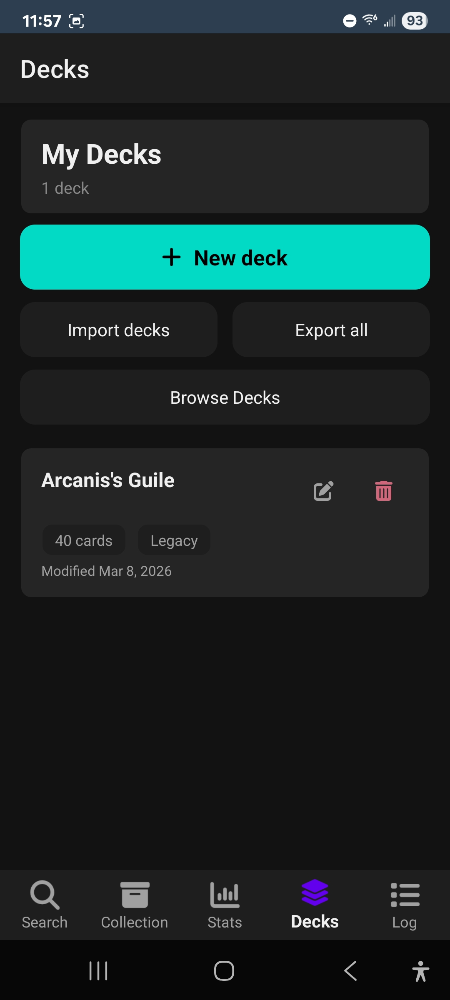
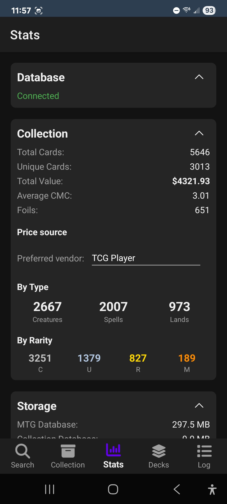

# AetherVault

AetherVault is a .NET MAUI app for browsing, searching, and managing **Magic: The Gathering** cards and personal collections.

It uses a local SQLite copy of MTGJSON data, downloads card images from Scryfall, and stores user collection/deck data in a separate local database.

Decks are slowly being added.

---

## What this repo is built with

- **Language/Runtime:** C# on .NET 10 (preview features enabled)
- **UI:** .NET MAUI + XAML
- **Pattern:** MVVM (CommunityToolkit.Mvvm) + Repository pattern + DI
- **Data access:** SQLite + Dapper
- **Rendering:** SkiaSharp (custom card grid rendering)
- **Platform target:** Android (`net10.0-android`)

---

## Requirements

To build this project locally, you need:

1. **.NET 10 SDK** (preview-compatible for this project)
2. **.NET MAUI workload** (including Android)
3. **Android SDK** (API 21+ supported by project settings)
4. **Java JDK** required by MAUI/Android toolchain
5. Internet access on first app launch (for initial MTG database download)

---

## Quick start (build + run)

From repo root:

```bash
dotnet workload install maui
dotnet workload install maui-android
dotnet restore AetherVault.sln
dotnet build AetherVault.csproj -f net10.0-android -m
```

To run on Android emulator/device:

```bash
dotnet build AetherVault.csproj -t:Run -f net10.0-android -m
```

**Faster builds:** Use `-m` for parallel MSBuild (uses all cores). Debug builds use Fast Deployment by default (only changed assemblies are redeployed), so incremental build+deploy is quicker. For a single full APK (e.g. for sharing or devices where Fast Deployment fails), set `EmbedAssembliesIntoApk` to `True` in the Debug property group in `AetherVault.csproj`.

---

## Run tests

Use the test project directly:

```bash
dotnet test AetherVault.Tests/AetherVault.Tests.csproj
```

---

## How the app works (high level)

- On startup, the app checks for the MTG master database (`MTG_App_DB.zip`) and downloads it if needed.
- Two SQLite databases are used:
  - **Read-only MTG database** for card/search data
  - **Read-write collection database** for user-owned cards and decks
- `CardManager` coordinates repository/services.
- Search uses `MTGSearchHelper` to build parameterized SQL queries safely.
- Card grid rendering is performance-focused via SkiaSharp custom controls.

---

## Repo structure (short)

- `Data/` – repositories, SQL query definitions, database manager
- `Services/` – app services (image cache/download, card manager, deck builder, etc.)
- `ViewModels/` – MVVM view models
- `Pages/` – MAUI XAML pages
- `Controls/` – custom UI controls and renderer code
- `Core/` – shared models/enums/utility logic
- `AetherVault.Tests/` – xUnit tests

---

## Screenshots

<table>
  <tr>
    <td align="center"><br/><b>Search</b></td>
    <td align="center"><br/><b>Collection</b></td>
    <td align="center"><br/><b>Card Detail</b></td>
  </tr>
  <tr>
    <td align="center"><br/><b>Decks</b></td>
    <td align="center"><br/><b>Browse Sample Decks</b></td>
    <td align="center"><br/><b>Stats</b></td>
  </tr>
</table>

---

## CI / database update automation

GitHub Actions workflow (`.github/workflows/main.yml`) runs weekly and can be triggered manually to:

1. Download MTGJSON SQLite data
2. Trim/optimize it
3. Publish `MTG_App_DB.zip` to GitHub Releases

The app then consumes that release artifact for local DB setup.
